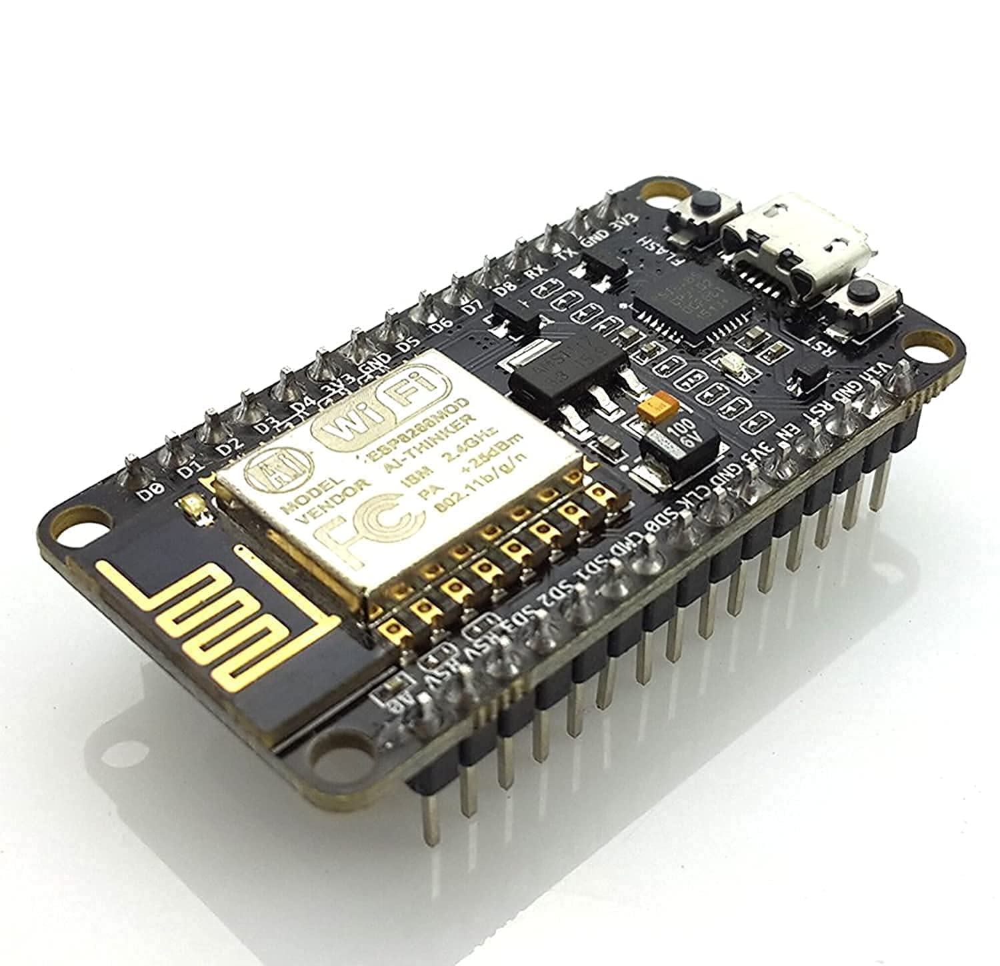

# Weather Station using ESP8266 and DHT11 Sensor

### A weather station prototype using ESP8266 and DHT11 Sensor with ThingSpeak for IoT analytics.

Description: Writes temperature and humidity values (DHT11) to a channel on ThingSpeak every 15 seconds.

### Hardware:
* DHT11 Sensor
* ESP8266 board

<picture>
  
</picture>

### Software:
* Arduino IDE
* Libraries (ESP8266, ThingSpeak, DHT)

_!!! IMPORTANT - Modify the secrets.h file for this project with your network connection and ThingSpeak channel details. !!!_

### Note:
- Requires ESP8266WiFi library and ESP8622 board add-on. See https://github.com/esp8266/Arduino for details.
- Select the target hardware from the Tools->Board menu
- This example is written for a network using WPA encryption.

### What is ThingSpeak?
[ThingSpeak](https://www.thingspeak.com) is an analytic IoT platform service that allows you to aggregate, visualize, and 
analyze live data streams in the cloud. Visit [ThingSpeak](https://www.thingspeak.com) to sign up for a free account and create a channel.

### Demo
As shown in the image below, you can find the charts for uploaded weather data on ThingSpeak channel in the cloud.

(Left: Temperature / Right: Humidity)

<picture>
  
</picture>

-----

Watch the implementation of this code on our YouTube channel: https://www.youtube.com/@Roboticxps

To get your own tools by visiting our online store: https://roboticx.ps/
Follow us on social media:

* Facebook: https://www.facebook.com/Roboticxps
* Instagram: https://www.instagram.com/roboticx.ps/
